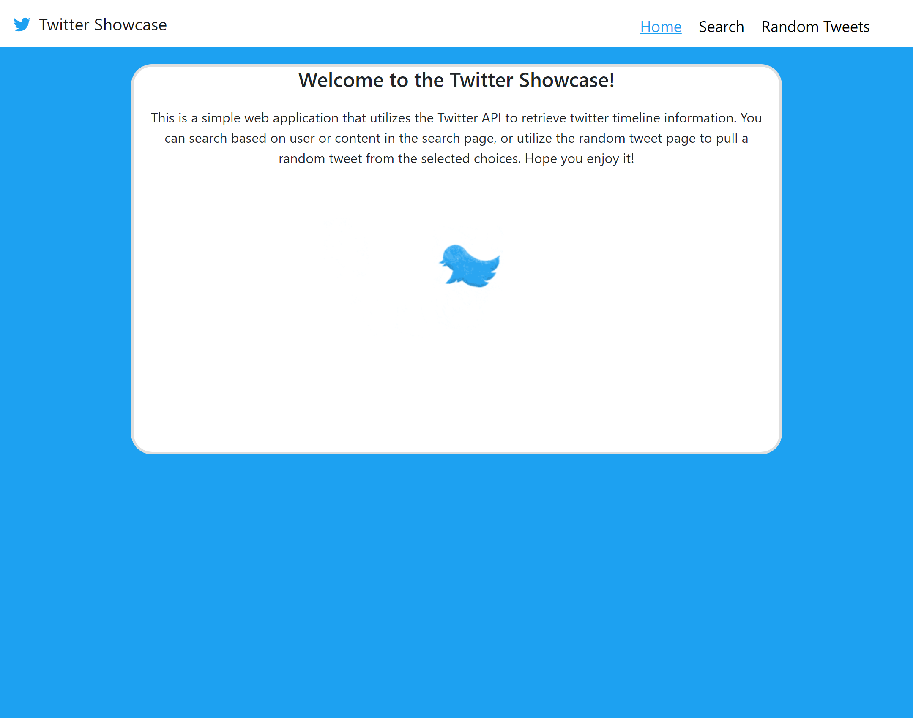
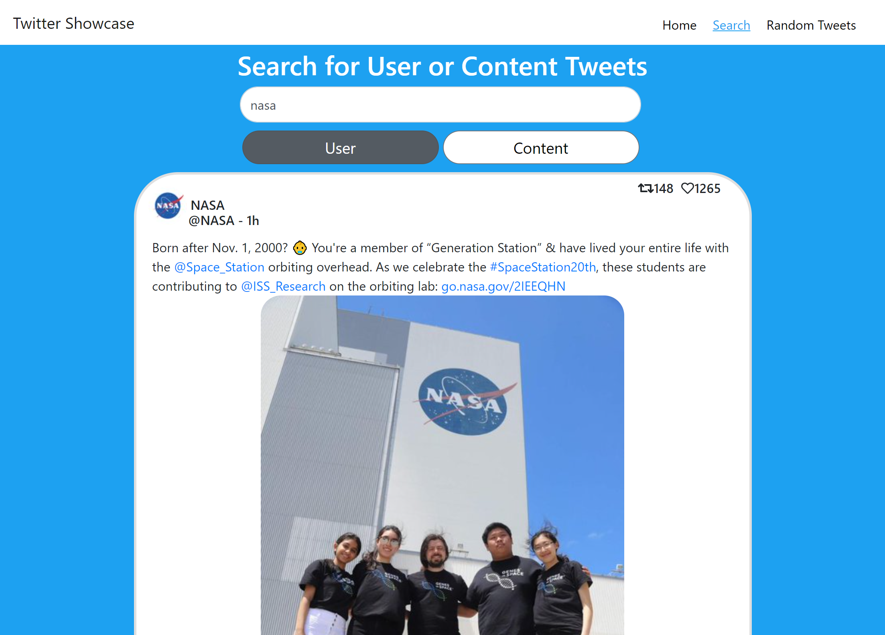
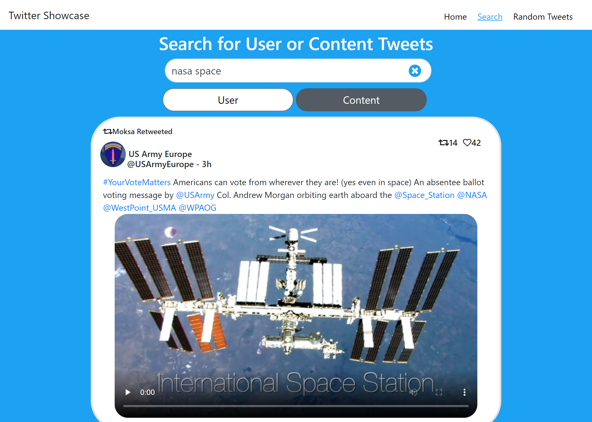
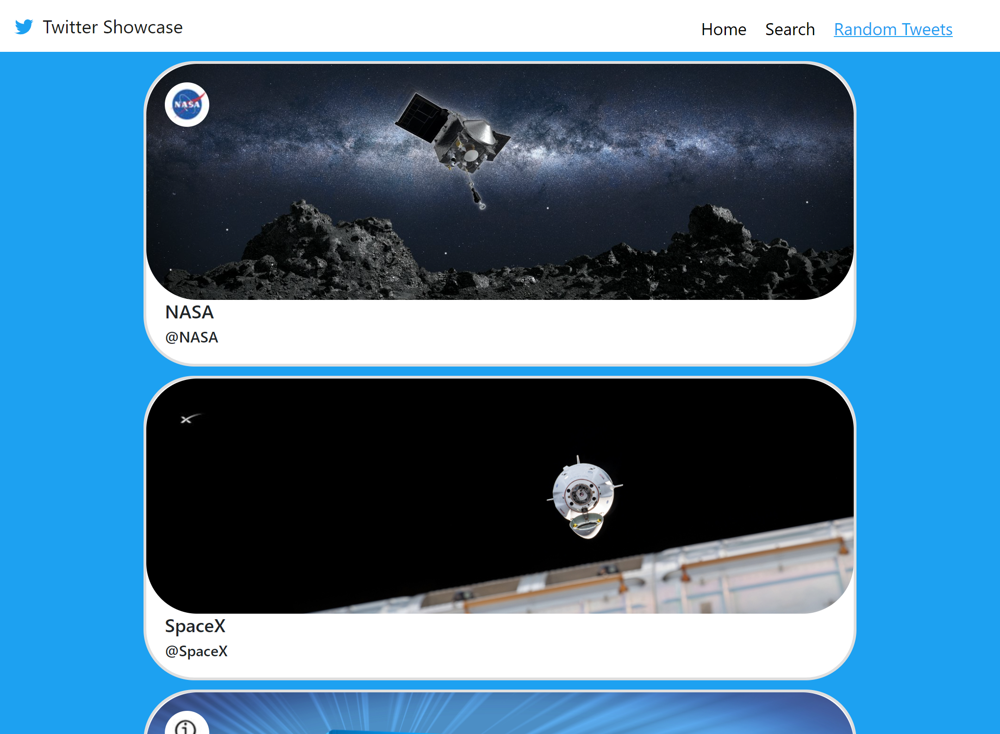
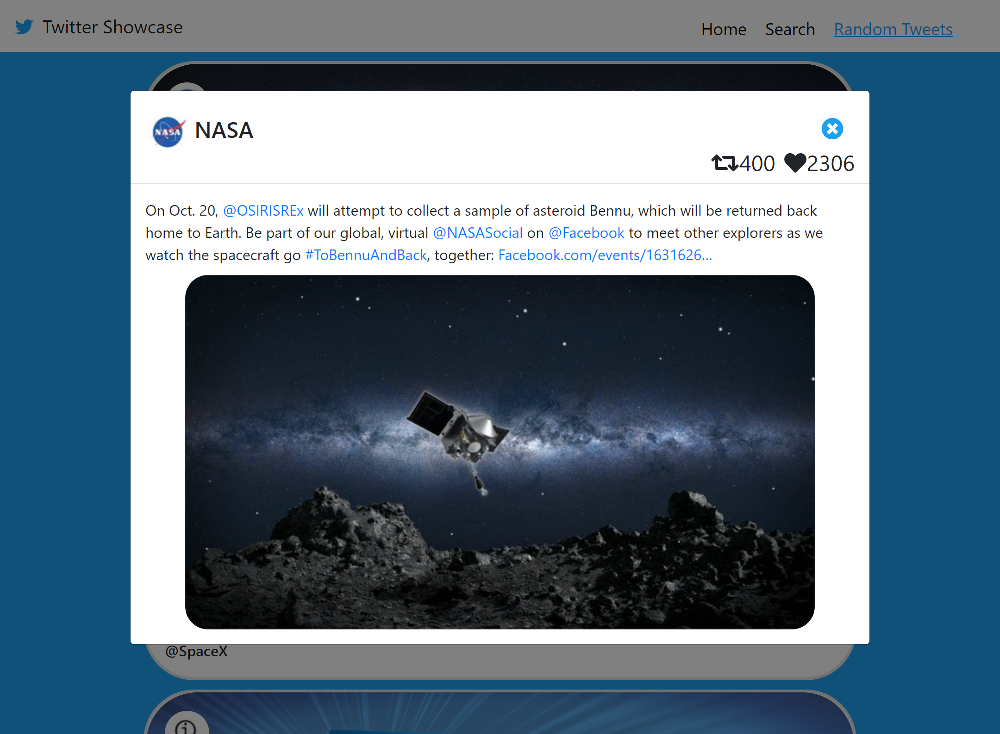

# Twitter Show Case Application
The application utilizes Twitter API 1.1 and was built using ReactJS (Frontend), C# with ASP.NET Core (Backend) and styled with Bootstrap 4

Run Application [Here](https://twittershowcase-hcuellar.azurewebsites.net/)

<p align="center">

</p>

## Summary
This web application utilizes Twitter API 1.1 to retrieve tweets and display them using Bootstrap for styling and responsiveness. ReactJS was used to develop the frontend of the web application. While the backend uses C# with ASP.NET Core for RESTFUL WebAPI and Internal API calls. Session storage is used to store the last search, search type, and random tweet selection for a smoother user experience. 

### Search Page
The search page allows you to search based on a user or content with the click of the corresponding button. The user search will retrieve data from a specific user's timeline. The content search is far broader and will return tweets with any mention of the terms in the search bar. So, there is a need to be more specific with your searches. Both options will cursor more tweets as you scroll down looking for more tweets, making the experience smoother. 
#### _Search for user_
<p align="center">

</p>

#### _Search for content_
<p align="center">

</p>
<br>
<br>

### Random Tweet Page
The random tweet page features 5 Twitter user choices, chosen by yours truly. Clicking on a user's card will bring up a simple Tweet modal that will reveal a random tweet from that selected user. 
<p align="center">

</p>

#### _Random Tweet from Nasa_
<p align="center">

</p>

## Installation
Rename file `Edit-App.config` to `App.config` in `TwitterShowcaseApplication/API/Config/` and add Bearer Token into the Bearer key value pair.
```javascript
<add key="BEARER" value="INSERT BEARER TOKEN"/>
```
To generate a Bearer Token, you will need to set up a Twitter Developer Account and create a Twitter API App. This will generate a Bearer Token.

### Author's Note
Creating this web application I learned how to integrate a ReactJS Front End with C# in a ASP.NET Core Back End for RESTful web API calls and Internal API calls. Also, it was my first time using Microsoft Visual Studio to deploy my web application using Microsoft Azure. I had a great time creating the application and working through the intricacies of integrating different technologies together. Also working on styling the web applicaiton to work well with Mobile Devices was a treat! I hope you enjoy the using it!

## Author
Heriberto Cuellar – Full Stack Software Developer - [Website](https://heribertocuellar.com) | [LinkedIn](https://www.linkedin.com/in/heriberto-c-5aa11952)